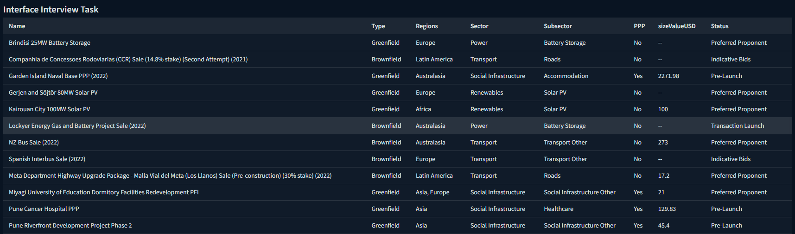

# Interview Pairing Exercise
The purpose of this exercise is to see:
- how you structure your code
- how you test your code.

We have provided a skeleton application for you to extend, based on the tech stack we use.

Please limit yourself to a few hours on this task. We just want a sample of your work and to see your process.

## Set up
Run `yarn` to install all the necessary dependencies.
Run `yarn dev` to start the sandbox app running on http://localhost:1234/

## The Exercise
In the root directory, you will find a file named `transactions.json`. You will also find in this solution a functional 
React component called `DataTable`. We would like you to render the data in the `transactions.json` onto the site 
you are running from `yarn dev`, using the `DataTable` component provided.

We expect you to:
- document any decisions you make (feel free to extend this README)
- use TDD

Here is an example image of what you might end up with:

